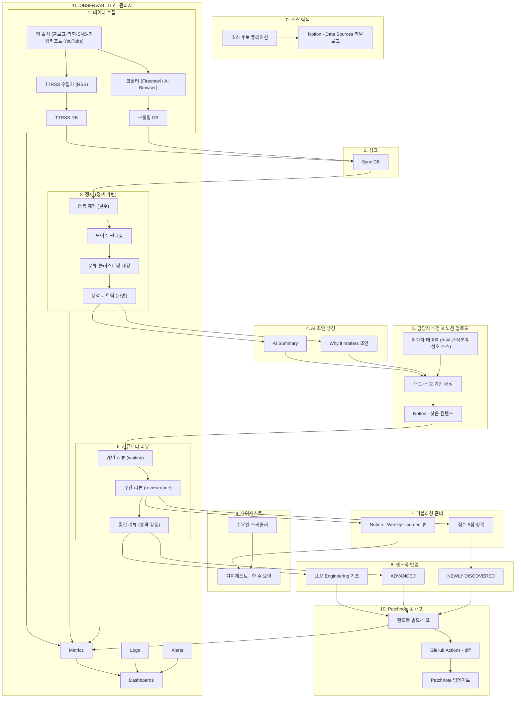

# 15. 핸드북 Product Overview (250813)

Created: January 20, 2025 8:26 PM
Tags: Product Spec, 시스템 설명 & Core Docs
Hide: No
체크 표시됨: No

## Overview

---

<aside>
⭐

LLM 생태계 변화를 가장 빠르게 파악하는 개방형 지식 플랫폼

</aside>

- LLM과 그 개발 관련한 모든 공개된 정보를 모니터링 / 수집하여
- 커뮤니티-드리븐 ‘협력적 리뷰’를 거쳐
- 지식을 정제해서 핸드북 형태로 제공합니다.

## Problem

---

- LLM과 관련된 정보 - 사람이 다 파악하는게 불가능할 양과 속도로 나온다.
- 블로그나 유튜브를 통해서 한다리 건너 정보를 받아오면 느리다!
- 놓친 게 있을까 두렵다. 중대한 변화가 빠르게 일어나다 보니, 뭔갈 모르고 넘어가는게 나중에 큰 영향을 준다.

## Solution

---

새로운 소식들을 빠르고 총체적으로 정리해주는 AI 시스템을 만들고, 그 데이터를 (매주 스터디에서) 협력적으로 리뷰하고 검증한 후, 결과물 지식을 가공 배포하여 생태계에 기여하자.

1. 새로운 소식들을 빠르고 총체적으로 정리해주는 AI (백엔드) 시스템을 만들자.
    - 기술 블로그부터 AI 학회까지, 새로 생산되는 정보들의 발원지로부터 정보를 수집하자
    - 재공유하는 채널 (SNS/유튜브) 또한 수집해, 해당 키워드에 대해 중요도와 평가를 알아보자
    - LLM으로 중복과 노이즈를 거르고, 키워드를 추출해서 사람의 손길을 줄이자!
2. 커뮤니티 협력 **리뷰**를 통해 중요도 평가 및 검증한다. 
    - 평가: ex) '이거 꼭 알아야 한다' 혹은 '너무 지엽적이다' 등
    - 매주 n개씩 나눠서 평가한다
    - 중요한 결과물 m개만 추려서 스터디에서 다룬다
3. 리뷰를 거친 결과물을 정제하여 지식으로 만들자
    - LLM 학습자가 필요한 순서대로 개요를 정리하자 ('핸드북 UI')
    - 이번 주 "패치노트" / 'LLM 메타 변경' 등으로 변경한 페이지를 만들자

### 참고하는 프로젝트들

https://readpartner.com/

## Dair AI

아래처럼, 특정 분야 + 관련 테크닉이 전부 모여있길 원합니다.  https://www.promptingguide.ai/techniques

### ‘파이토치 코리아 커뮤니티 - 새로운 소식

최신 뉴스들이 올라오는 정말 좋은 곳입니다! 

우리는 여기서 한발 더 나아가보고 싶어요

1. 뉴스 피드만 /// 트위터 평가, 링크드인 부분 좀 더 총체적인 내용들까지
2.  

[https://www.futureloop.com/subscribe/30-Your-Newsletter481505](https://www.futureloop.com/subscribe/30-Your-Newsletter481505)

나한테 맞는 소식들만 모아서 주는 곳. 

- **LLM Daily**
    - **요약**: 매일 AI 생태계의 핵심 내용(논문, GitHub, 리포지토리, 뉴미디어 등)을 종합적으로 정리한 뉴스레터
    - **특징**: 다양한 소스(예: Subreddits, arXiv, Hugging Face 등)를 한데 모아 하루 단위로 분석 및 요약 제공 [Buttondown](https://buttondown.com/agent-k/archive/llm-daily-update-march-27-2025/?utm_source=chatgpt.com)
- **ReadPartner**
    - **요약**: AI 기반 요약과 미디어 인텔리전스 플랫폼으로, 수천 개의 트렌드를 자동으로 모니터링 및 요약하고, B2B 맞춤 뉴스레터를 제공
    - **특징**: 수만 개 소셜 및 뉴스 소스를 실시간으로 분석하여 요약, 2025년 기준 10,000명 이상의 사용자 보유 [위키백과](https://en.wikipedia.org/wiki/ReadPartner?utm_source=chatgpt.com)
- **Auto-News (LangChain 기반)**
    - **요약**: 여러 소스(RSS, 트위터, 웹, 유튜브 등)에서 정보를 자동으로 끌어와 LLM으로 요약 및 정제, 정기 요약 제공
    - **특징**: 개인화된 뉴스 집계 + 노이즈 제거 기능을 갖춘 오픈소스 프로젝트 [arxiv.org+6github.com+6reddit.com+6](https://github.com/finaldie/auto-news?utm_source=chatgpt.com)

[https://botool.oursophy.com/paper-archive/](https://botool.oursophy.com/paper-archive/)  

- 카카오톡 방에서 언급되는 링크들을 모읍니다.
- 한 페이지로 보여줍니다
- 많이 언급할수록 빨갛게 올라옵니다.

### **대상 사용자**

**1차 대상**: LLM API를 활용해 제품·서비스를 개발하지만 직접 모델을 개발하지는 않는 **AI 엔지니어**.

**2차 대상**: AI 제품 기획자, 일반 AI 연구자, LLM 트렌드 팔로워, 모델 리서처 및 학계 관계자. 

### 가설

1. ‘정제’ - 필요한 걸 뽑아줄 것이다. 
2. 사람들은 이런 정보/UX를 필요로 할 것이다 

### **성공 기준 (Success Criteria)**

1. 매주 weekly 리포트 발행.
2. 리포트 조회수·구독자 수의 꾸준한 증가.
3. 매 시즌, *O’Reilly* 텍스트북 내용을 월 단위로 반영.
4. **데이터 소스 커버리지 확보**:
    - Substack 유력 아티클
    - LinkedIn, YouTube, Twitter 주요 인물 계정 각 250개 이상 모니터링
    - Medium 서브그룹, Generative Network(GN), Dev.to 등 신디케이트 사이트에서 추천 알고리즘 학습
5. **자동화 인프라 완성**:
    - AI가 자동으로 정보 수집 → 요약 → 정제
    - ~~협력 리뷰 대기 상태 저장~~
    - 리뷰 후, 분류와 배포 (핸드북 / 뉴스레터 )

## 쥬피터북 (핸드북) UI

### LLM Engineering - 기초 (섹션 1)

<aside>
⭐

각 단원이 들어갑니다. 

- ‘교과서’ 급 단행본들에 공통으로 나오는 주제를 여기에 담습니다.
    - Foundation Models
    - 프롬프트 엔지니어링
    - RAG
- 가볍게 다룹니다.
- 실제 개념을 다루는 내용은 레퍼런스에 넣어 줍시다.
</aside>

### 글의 포맷 설명

**Summary**

<aside>
⭐

이 개념은 왜 중요한가? 

</aside>

Prompt engineering은 LLM의 성능을 향상시키기 위해 입력 쿼리나 지침을 조작하는 기술입니다. 이는 LLM이 원하는 출력을 생성하도록 유도하는 데 사용됩니다. 효과적인 프롬프트 엔지니어링은 LLM의 훈련 데이터와 구조를 이해하고, 언어 해석의 미묘한 부분을 고려하며, 지속적인 테스트와 평가를 통해 프롬프트를 개선하는 것을 포함합니다.

**Key Concepts**

<aside>
⭐

이 개념을 습득해서 일을 할 수 있으려면, 어떤 하위 개념/지식들을 알아야 하는가? 

</aside>

- **Prompt Engineering** : LLM의 성능을 향상시키기 위해 입력 쿼리나 지침을 조작하는 기술.
- **Transparency of Prompts** : 프롬프트의 투명성이 LLM의 성능을 향상시키는 데 중요합니다.
- **Hyperparameters Tuning** : LLM의 성능을 조정하기 위해 hyperparameters(예: temperature, top-K tokens, embeddings, architecture)를 조정하는 기술.
- **Iterative Process** : 프롬프트 엔지니어링은 지속적인 테스트와 평가를 통해 프롬프트를 개선하는 반복적인 프로세스입니다.

**References**

<aside>
⭐

이걸 제대로 배우려면 뭘 보면 되는가? 

장차 퀄리티 순으로 정렬이 되어야 합니다. 

</aside>

### LLM Engineering - 심화 (섹션 2)

<aside>
⭐

“모두 알아야 하는 내용” 은 아닌 심화 주제들을 다룹니다.  

- 승격: 어떤 내용의 중요성이 더 커졌다고 판단이 되면. 1단계로 올려보냅니다
    - 이 판단은 ‘월간 모임(둘째 주 토요일)’에 의제로 냅니다.
</aside>

단원 별 포맷은 ‘기초’와 같습니다

### LLM Engineering - newly discovered

<aside>
⭐

 매주 모인 소식에서 5점 받은 내용이 담깁니다. 

- 승격: 어떤 내용의 중요성이 더 커졌다고 판단이 되면. 1단계로 올려보냅니다
    - 이 판단은 ‘월간 모임(둘째 주 토요일)’에 의제로 냅니다.
</aside>

이쪽은 위의 단원 별 포맷을 그대로 쓰지 않습니다.

5점을 받은 뉴스의 요약본을 그대로 올립니다. 

[UI & Information Architecture](https://www.notion.so/UI-Information-Architecture-289f199edf7c8054ae55fd2259d383b9?pvs=21) 

여기 들어갈 내용 

- 신성 논문  - 나왔을 당시의 mamba
- 갓 나온 툴 - windsurf, langflow
- 기타 주목할 만한 대부분 내용들

---

### Digest

<aside>
⭐

“다이제스트”란 특정 분야의 정보를 간결하게 요약한 자료를 의미합니다. 

</aside>

**weekly update** 

<aside>
⭐

각 소식을 중요도 순서로 정렬합니다

1. 내용 요약, 2. 의미 (why it matters) 3. 점수

</aside>

[This week’s Highlights](https://www.notion.so/This-week-s-Highlights-1f4f199edf7c8081a514fdb557182565?pvs=21) 

**Patchnote(changelog) - 이름 고민중**

<aside>
⭐

나무위키의 “변경사항 추적” 페이지 같은 느낌. 

다른 점 - 오타 고치는 등의 사소한 수정은 드러내지 않고, 항목 추가 / 삭제만 다룹니다. 

이것만 봐도 무엇이 새롭게 추가되었는지 한눈에 알 수 있겠죠. 

</aside>

patchnote 화면 예시 : 

**Patchnote:** 

**8/13일** 

MCP 단원 - “유용한 MCP 서버”  - “윈도우즈 MCP 서버 플러그인”이 추가되었습니다.  (링크)

Foundation Model 소개 단원 - OpenAI/GPT 섹션 - “GPT 3.5 - 더 이상 서비스되지 않음” 이유로 아카이브 되었습니다 (링크) 

---

**8/12일** 

MCP 단원 - “유용한 MCP 서버”  - “윈도우즈 MCP 서버 플러그인”이 추가되었습니다.  (링크)

Foundation Model 소개 단원 - OpenAI/GPT 섹션 - “GPT 3.5 - 더 이상 서비스되지 않음” 이유로 아카이브 되었습니다 (링크) 

**월간 리포트 (다음 페이즈로 미룹니다)** 

<aside>
⭐

weekly update/patchnote를 모아 발전시킵니다. 

소식이 나올 당시와 시간이 있습니다. 

실제로 그 개념이 시장에 받아들여졌는가도 추가하고 (ex. MCP 검색량, 좋아요가 엄청 늘어났다 / GPT5 - 생각보다 반응이 별로다) 

우리의 해석이나 통찰을 담는 글이 되겠죠

장점: 

리포트를 발행해 순환시킬 수 있으면 더 많은 사람들에게 더 권위있는(?) 진지한 움직임으로 받아들여 질 겁니다. 

단점: 

힘듭니다

 

자원자가 있으면 하는게 맞겠습니다. 이미 이런 글로 먹고사는 분들과 협업하는게 좋겠군요. 

</aside>

### Contribution Guide

글 작성 방법, 프로젝트 상세 소개 등등을 소개하는 문서가 될 겁니다

- 노션 문서가 수정되면, 자동으로 github에 반영되는 시스템 필요

---

## 노션

- **데이터 sources DB [퍼올 Data Sources & 그 분류](https://www.notion.so/Data-Sources-1f4f199edf7c8033bab4c9f7873ff69b?pvs=21)**
- **찾은 자료 DB** [AI 정보: 데이터 소스 & 찾은 컨텐츠](https://www.notion.so/AI-1abf199edf7c8089868ed2b8b7d847b6?pvs=21)
- **Weekly Update 페이지 [This week’s Highlights](https://www.notion.so/This-week-s-Highlights-1f4f199edf7c8081a514fdb557182565?pvs=21)**

## TTRSS

설명 생략 

# System Flow

1. 데이터 수집: 
    1. 출처: 기술 블로그, 학회 발표자료, 소셜 미디어 피드, 기업 리포트, 유튜브 영상 스크립트 
    2. 웹의 각 출처에서 정보 생산됨
    3. RSS 피드 지원시: TTRSS 사용, 데이터를  TTRSS DB에 저장 
    4. 미지원시 크롤링, 크롤링 DB에 저장 
        1. 전용 Crawler 사용 
        2. Firecrawler나 AI Browser 
2. 정제, 처리 : LLM을 활용한 **중복 제거** 및 **노이즈 필터링**, **키워드 및 링크 추출, 클러스터링 & 태깅**
    1. TTRSS /크롤링 DB의 내용을 싱크 DB로 가져옴
    2. 중복 제거: 거의 똑같은 소리 하는 걸, LLM으로 제거하고 고유한 내용만 남겨보자 (상세 방법 불명) 
    3. 클러스터링 & 태깅 - 이 자료가 어디에 속할까? MCP / RAG 등등 태그가 붙어야 함
    4. 분석 
        1. `Keyword/Topic Cluster · Impact Score · Novelty · Fact/Opinion Split`
        2. ~~리포트 생성 단계 - 이번 주/이번 달 일어난 일을 요약.~~ 
            - ~~추출된 데이터로부터 키워드 빈도 및 중요도를 분석~~
            - ~~리포트 내용: 사실, 의견, added value 분류 및 독창성 여부 평가~~
    5. 요약: 각 자료에 대해, AI summary, why it matters 초안 집어넣기.  
    6. 자료별 담당자 배정: 
        1. 참가자들 정보가 담긴 테이블에 분야 정의:  직무 (개발자, 연구자) / 관심 분야 (RAG, 서빙) 
        2. 태그를 기준 자료에 사람 배정  
    7. 노션 DB에 업로드 
3. 커뮤니티 리뷰: 
    1. 개인 리뷰: 
        1. 노션 DB에 올라간 자료에 작업. 칼럼에 요약/의미를 보완하고, 점수 매기고, waiting for group review로 표기 
    2. 주간 리뷰:
        1. 그룹 차원에서 점수 보정, 요약 의미 등 확인, review done으로 표기 
    3. 주간 리뷰를 마친 후, notion DB 의 자료를 sync DB로 가져옴
    4. 월간 리뷰: 
        1. 이번 달에 추가된 것이 무엇인지 확인하고 (patchnotes page) / 승격 or 강등 시킬 게 무엇인지 등을 정함. 
        2. 관련 내용을 쥬피터북에 바로 업데이트 (손으로) 
            1. 사람이 손으로 함. 
                1. (나중에는 에이전트 시켜서, 폴더 만들고, 적절한 챕터 만들어서 할 수 있을 것이다) 
            2. 관련 챕터에 글을 넣고, TOC.yml을 업데이트 해 주어야 한다
4. 배포:  핸드북에 업로드 (쥬피터북)
    1. 이번 주차의 "weekly update" 페이지 
        
        
        - “weekly update” 생성
            1. [AI 정보: 데이터 소스 & 찾은 컨텐츠](https://www.notion.so/AI-1abf199edf7c8089868ed2b8b7d847b6?pvs=21) 에서 이번 주 자료를 날자로 필터링 
            2. ‘제목’, ‘AI 요약’과 ‘why it matters’ 읽어 와서 한 페이지에 모음
                1. 점수로 정렬
                2. [This week’s Highlights](https://www.notion.so/This-week-s-Highlights-1f4f199edf7c8081a514fdb557182565?pvs=21) 양식으로 마크다운 문서로 정리. 
                    - 마크다운 형식 주의 - h1 쓰면 안됨
                3. 3점 이하는 토글에 포함시켜 접어버리기. 
            3. This week’s Highlight에 오늘자 날자로 새 문서 하나 파서, 작성된 문서를 집어넣음
            4. https://github.com/springCoolers/llm-handbook/blob/main/_contents/digest/weeklynews/weeklynews.md - [weeklyupdate.md](http://weeklyupdate.md) 파일의 상단에 내용이 업로드되어야 함. (한 페이지에 누적한 형태로 보여짐 )
                1. ‘소개글’, ‘이번 주 소식’, ‘그 전 주 소식’ 
                    1. 기존 내용을 해치지 않고, 새 내용만 추가해주세요. 
                2. ~~b에서 만든 내용을, 싱크 DB로 가져와야 함~~
        1. 뉴스레터 형태로 발행
            1. 이거 해주는 오픈소스 프로그램을 사용함 (찾아야함)  
            2. 이번 주 내용 템플릿대로 업로드
    2. **5점인 내용**들을 핸드북 업로드 
        - 어떤 기준으로, 무엇을 올릴지 현재 불명확함.
        1. **본격 요약본 md 생성** 
            1. 논문 리뷰하는 블로그 글 수준의 글을 뽑아내기
            2. 파이토치 코리아에 업로드해주시는 글과 비슷하다. 
        2. 적절한 위치에 배치 - 에이전트가 제안하고, 사람이 승인함.  
            1. 단원이 있는 경우 - 그 단원의 적절한 페이지에 업데이트 
                1. 페이지 자체를 추가 
                    1. 케이스 1) GPT 5 메이저 업데이트 사항 
                        1. ‘파운데이션 모델’ 단원이 있다고 가정하자. 
                        2. GPT 모델을 위한 페이지를 새로 만들어서 넣어야 할 것. 
                    2. 에이전트가 어떻게 할 수도 있을 것 같다
                2. 페이지에 일부 내용 추가 
                    1. 케이스) 핫한 MCP 서버에 대한 소식을 발견
                    2. ‘MCP’ 단원 - ‘유용한 MCP 서버 목록’ 페이지
                    3. 하단에 한줄 추가
                    4. 이것도… 에이전트가 해줘야 하겠지 
            2. 단원이 없는 경우 - newly discovered 폴더에 업데이트 - github에 push 하면 됨 
                1. newly discovered에도 폴더가 있을 예정. [정보의 Taxonomy & 종류별 템플릿 - 250705](https://www.notion.so/Taxonomy-250705-227f199edf7c80c7a0e5d4d76df927cf?pvs=21) 에 있는 14개 폴더. 
    3. 업로드 사항을 patchnote에 변경사항 기록 
        1. 깃헙 액션 - 푸시 때마다 페이지 추가 삭제 / 문서간 diff 내용을 읽어옴 
        2. 에이전트가 정리해서 업로드 
            1. 사소한 변경을 제외하고, 이용자들이 알 만한 것들만 남기게 하는게 중요할 듯. ex) 오타 수정
    4. 관리자를 위한 부분: [OBSERVABILITY] Metrics · Logs · Alerts · Dashboards

---

# System Architecture

---

# Roadmap

1. 파이프라인 구현 수집하고 정제하는 
    1. 데이터 확보 : 실험해서 검증하기 위해
2. 추가적인 기능 구현 - 
    1. RAG, 개인화 
    2. 자동 스코어링 

# 참고자료

### 리포트 / 인사이트 UI 예시

1/15일 오늘 수집된 데이터 예시: 

오른쪽 기사가 마음에 든다

- 여러 트윗, 글 등을 합쳐서, 특정 키워드에 관해, 오늘 나온 새로운 소식이 전부 정리되었으면 좋겠다…!

---

| Entity / Tag  | 서술 | Review |
| --- | --- | --- |
| Stable Diffusion | 출시되자마자 최단기간 star 수를 기록했다 | 철수: 스테이블 디퓨전은 중요하다. 이번 주에 다루자 |
| LangChain / (RAG / PE ) | 버그가 많고 지나치게 추상화되어 구현이 오히려 불편하다 | 영희: 불편한거 맞다 그래도 대세가 될 것 같다 |
| [**KAG](https://discuss.pytorch.kr/t/kag-knowledge-augmented-generation-feat-ant-group/5791)**  | 랭그래프 해 보니까 예전으로 못돌아가겠더라 |  |
| AI Career Prospects | 모델 개발보다 API 활용 비즈니스 가치 창출 직업이 더 유망할 것이라고 전망 |  |
| [**NVIDIA-Ingest:**](https://discuss.pytorch.kr/t/nvidia-ingest-pdf-word-powerpoint/5843)  | [**PDF, Word, Powerpoint 등으로부터 텍스트, 이미지, 표 등을 추출하는 마이크로서비스**](https://discuss.pytorch.kr/t/nvidia-ingest-pdf-word-powerpoint/5843) |  |
| [**NVIDIA-Ingest:**](https://discuss.pytorch.kr/t/nvidia-ingest-pdf-word-powerpoint/5843)  | 1. **다양한 문서 형식 지원**: PDF, Word, PowerPoint 파일뿐만 아니라 이미지 처리까지 지원합니다.
2. **유연한 추출 옵션**: 문서별로 텍스트, 이미지, 표, 차트 등의 추출 방법을 자유롭게 선택할 수 있습니다.
3. **벡터 데이터베이스 통합**: 추출된 데이터를 벡터로 변환하여 Milvus에 저장 및 관리할 수 있습니다.
4. **고성능 병렬 처리**: NVIDIA GPU를 활용한 병렬 처리를 통해 높은 처리량과 효율성을 자랑합니다.
5. **확장성과 유연성**: NIM(NeMo Inference Microservices) 컨테이너 기반으로 구성되어 있으며, Docker Compose와 Kubernetes를 통한 배포를 지원합니다. |  |
|  | **실행을 위한 요구조건: 
GPUFamilyMemory# of GPUs (min.)**H100SXM or PCIe80GB2A100SXM or PCIe80GB2 |  |

UI 고민 

- 한 행에 서술 제한이 140정도면 좋을 것 같다.
- 길어지면 나눠도 좋겠네.
- 핸드북 컨셉 :

리뷰의 목적: 

1. 우리한테 유용한가? 
2. 그래서 핸드북에 올릴 필요가 있는가? 

### 가면서 추가할 만한 내용들 (GPT 제안)

- Originality: A qualitative score assessing the uniqueness of the content
- **Appendix**: Sources and additional notes for in-depth review
- **Keyword Frequency**: Number of mentions across sources
- **Engagement Metrics**: Likes, shares, comments for social media
- **Importance Score**: Calculated based on a combination of frequency and engagement metrics
- **Trend Indicators**: Analysis of whether a topic is gaining or losing relevance

### User Interaction

- **Clickable Links**: Direct access to source material from the report
- **Customizable Views**: Filters to show only specific topics or timeframes
- **Feedback Options**: Users can rate or comment on the report's sections
- **Collaboration Features**: Shared review options with notes and highlights for team discussions