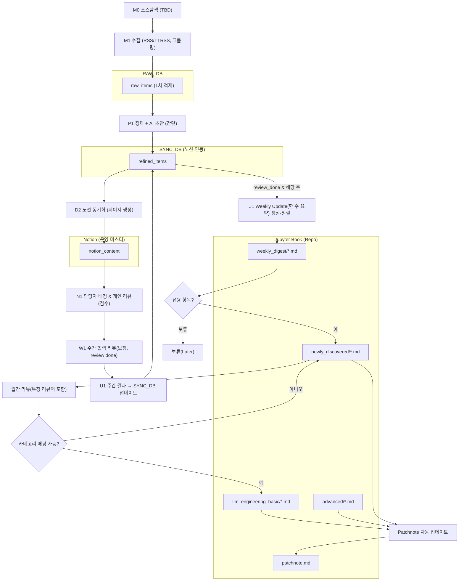

# 기능명세서

Created: August 15, 2025 8:30 PM
Tags: Product Spec
Hide: No
사람: 정영상
체크 표시됨: No

# **1) 목적 & 범위**

- **목적:** 공개 LLM 관련 정보를 정해진 흐름대로 모아 **주피터북 핸드북**을 꾸준히 갱신한다.
- **범위:** 소스탐색 → 수집(RSS/크롤링) → **1차 적재(Raw DB)** → **정제+AI 초안 → 싱크DB(노션 연동)** → **노션에서 배정·리뷰(개인→주간)** → **주간결과 싱크DB 업데이트** → **Weekly Update(한 주 요약) 생성·주피터북 반영** → **월간 리뷰(승격/강등)→Patchnote 자동 반영** → **관찰(Observability)**
- 세부 정책/스키마/권한은 **TBD**.

---

# **2) 시스템 전반 흐름 (Mermaid)**

# **3) 데이터베이스 스키마 (최소 가정)**

> 원칙: 타입 표기는 범용(SQL 계열)으로 표기, 실제 엔진 선택/세부 타입은 **TBD**
> 

## **3.1 RAW_DB (수집 원문 1차 적재)**

**raw_items**

| **컬럼** | **타입** | **설명** |
| --- | --- | --- |
| raw_id | UUID PK | 원문 레코드 식별자 |
| source_key | TEXT | 소스 식별자(예: feed/url 키) |
| url | TEXT UNIQUE | 원문 URL |
| fetched_at | TIMESTAMP | 수집 시각 |
| published_at | TIMESTAMP NULL | 원문 발행 시각(없으면 NULL) |
| title | TEXT NULL | 제목(있을 때만) |
| author | TEXT NULL | 작성자(옵션) |
| content_raw | TEXT | 원문 텍스트(가공 전) |
| content_hash | TEXT | 원문 해시(간이 중복 체크) |
| meta | JSONB | 기타 메타(HTTP, 헤더 등, **TBD**) |

> 인덱스: (url), (content_hash), (published_at) — 모두 **TBD**
> 

## **3.2 SYNC_DB (노션DB 연동용 정제+초안 결과 저장)**

**refined_items**

| **컬럼** | **타입** | **설명** |
| --- | --- | --- |
| item_id | UUID PK | 정제 레코드 식별자(=가능하면 raw_id 재사용) |
| raw_id | UUID FK→raw_items.raw_id | 원문과의 매핑 |
| canonical_url | TEXT NULL | 정규화 URL (**TBD**) |
| dedup_key | TEXT NULL | 중복 식별자(**TBD**) |
| normalized_text | TEXT | 정제 텍스트(간단 전처리) |
| tags | TEXT[] NULL | 태그(간단 문자열 배열, 규칙 **TBD**) |
| cluster_id | TEXT NULL | 클러스터 식별(**TBD**) |
| ai_summary | TEXT | AI Summary 초안 |
| why_it_matters | TEXT | Why it matters 초안 |
| notion_page_id | TEXT NULL | 노션 항목과의 연결(생성 후 세팅) |
| status | TEXT | refined / individual_done / review_done / monthly_decided (단계 최소화) |
| score_individual | INT NULL | 개인 리뷰 점수 |
| score_group | INT NULL | 주간 그룹 점수 |
| individual_reviewer | TEXT NULL | 개인 리뷰어(표기용, People 연동 **TBD**) |
| group_reviewed_at | TIMESTAMP NULL | 주간 리뷰 완료 시각 |
| weekly_digest_week_key | TEXT NULL | 예: 2025-W33 |
| weekly_update | BOOLEAN DEFAULT FALSE | “한 주 요약” 포함 여부 |
| nd_candidate | BOOLEAN DEFAULT FALSE | Newly Discovered 이동 후보 |
| monthly_decision | TEXT NULL | basic / advanced / nd / none |
| monthly_decider | TEXT NULL | 월간 심사자(특정 리뷰어 포함 확인용) |
| monthly_decided_at | TIMESTAMP NULL | 월간 결정 시각 |
| updated_at | TIMESTAMP | 갱신 시각 |

> 인덱스: (raw_id), (notion_page_id), (status), (score_group DESC, weekly_digest_week_key)
> 

**sync_events (선택, 간단 이력)**

| 컬럼 | **타입** | **설명** |
| --- | --- | --- |
| event_id | UUID PK | 이벤트 식별 |
| item_id | UUID FK | 대상 |
| event_type | TEXT | refined,pushed_to_notion,individual_scored,group_scored,weekly_exported,monthly_decided |
| payload | JSONB | 부가 데이터 |
| occurred_at | TIMESTAMP | 시각 |

## **3.3 Notion DB (운영상 마스터)**

> 실제 노션의 속성 타입/이름은 운영 중 정의. 여기서는 **최소 공통 필드**만 제안. 모두 **TBD** 가능.
> 

**notion_content (🛡️찾은 컨텐츠)**

| **컬럼** | **타입** | **설명** |
| --- | --- | --- |
| notion_page_id | TEXT PK | 노션 항목 ID |
| item_id | UUID NULL | SYNC_DB.refined_items와 매핑 |
| assignee | TEXT NULL | 담당자(노션 People) |
| status | TEXT | waiting / review_done |
| score_individual | INT NULL | 개인 점수 |
| score_group | INT NULL | 그룹 점수 |
| review_notes | TEXT NULL | 비고 |
| last_updated_at | TIMESTAMP | 최근 갱신 시각 |

**notion_people, notion_sources** 등 보조 테이블은 추후 (**TBD**).

## **3.4 Jupyter Book(파일/Repo)**

- **weekly_digest/**: 주간 “한 주 요약” 마크다운 파일
- **newly_discovered/**: ND 문서(하위 14개 폴더는 **추후 제공**)
- **llm_engineering_basic/**, **advanced/**: 월간 승격/강등 반영
- **patchnote.md**: 자동 변경 기록

> 파일명·TOC 구조는 단일 규약으로 **TBD**
> 

---

# **4) 모듈↔스키마 연계 (데이터 흐름)**

| **단계** | **읽기(READ)** | **쓰기(WRITE)** | **주요 키** |
| --- | --- | --- | --- |
| M0 소스탐색 | (없음 / Notion 소스 목록 **TBD**) | (없음) | — |
| M1 데이터 수집(RSS/크롤링) | 소스 목록(**TBD**) | **RAW_DB.raw_items** | url(UNIQUE), raw_id |
| D1 1차 적재 | (M1 내부 처리) | **RAW_DB.raw_items** | raw_id |
| P1 정제+AI초안 | **RAW_DB.raw_items** | **SYNC_DB.refined_items** (refined, 초안 포함) | raw_id→item_id |
| D2 싱크DB→노션 연동 | **SYNC_DB.refined_items** | **Notion**(notion_content 생성) + refined_items.notion_page_id 업데이트 | item_id↔notion_page_id |
| N1 개인 리뷰 | **Notion** | **Notion**(score/status 갱신) | notion_page_id |
| W1 주간 리뷰(그룹 보정) | **Notion** | **Notion**(status=review_done, group score) | notion_page_id |
| U1 주간결과→싱크DB | **Notion** | **SYNC_DB.refined_items**(score_group,status=review_done,weekly_update/nd_candidate 결정 가능) | notion_page_id→item_id |
| J1 한 주 요약(주피터북) | **SYNC_DB.refined_items**(review_done) | **Jupyter Book weekly_digest/** | weekly_digest_week_key |
| ND 이동 결정 | **weekly_digest/** 또는 **SYNC_DB** | **Jupyter Book newly_discovered/** (필요 시), **SYNC_DB.refined_items.nd_candidate=TRUE** | 파일 경로/item_id |
| 월간 리뷰(승격/강등) | **Notion** + **ND 파일** | **Jupyter Book**(basic/advanced 이동) + **SYNC_DB.refined_items.monthly_decision** | — |
| Patchnote 자동 | Git diff | **patchnote.md** | 커밋 SHA |

아래 각 모듈에 대해 **목적·입력·트리거·기능·출력·저장·권한·예외·메트릭·외부연동**을 정의합니다.

# 5) **모듈 기능 명세 (상세하지만 단순 규칙 유지 · 알고리즘은 TBD)**

> “무엇을 **반드시** 남기고, 어디에 **무엇을** 쓴다”를 중심으로 작성.
> 

### **M0. 소스 탐색 (TBD)**

- **목표:** 수집 후보 목록만 만든다(승인 기준/권한 모두 **TBD**).
- **출력:** 내부 목록(아직 DB 반영 없음, 혹은 노션 간단 표).

---

### **M1. 데이터 수집 (RSS/TTRSS, 크롤링)**

- **입력:** 소스 목록(**TBD**)
- **처리:** 각 소스에서 원문 가져옴. 수집 중 최소한의 필드만 채움.
- **쓰기:** **RAW_DB.raw_items** insert (없으면 신규, url 중복이면 skip)
- **필수 필드:** raw_id, url, fetched_at, content_raw (나머지는 NULL 가능)
- **오류:** 4xx/5xx/타임아웃은 재시도 후 실패 기록(**TBD**)

---

### **D1. 1차 적재 (Raw DB)**

- **역할:** M1과 동일 DB 작업. 가공 없이 저장만 확인.
- **출력 상태:** “원문이 **저장됨**” — 다음 단계의 입력.

---

### **P1. 정제 + AI 초안**

- **입력:** **RAW_DB.raw_items**
- **처리:**
    - 간단 정제(예: 줄바꿈/HTML 제거 수준, 방법 **TBD**)
    - (가능하면) 중복 키 생성(dedup_key 간이)
    - **AI Summary / Why it matters** 초안 생성(모델/프롬프트 **TBD**)
- **쓰기:** **SYNC_DB.refined_items** 새 레코드 생성(status='refined')
- **비고:** 복잡한 분석/분류/클러스터링은 **추후**. 여기서는 “정제 텍스트 + 초안”만 남김.

---

### **D2. 싱크DB→노션 연동**

- **입력:** **SYNC_DB.refined_items(status=‘refined’)**
- **처리:** 노션 항목 생성(담당자/점수는 아직 없음)
- **쓰기:** notion_content(노션) 새 페이지 + refined_items.notion_page_id 업데이트

---

### **N1. 노션에서 담당자 배정 & 개인 리뷰**

- **처리:** 노션에서 **담당자 배정**, **개인 리뷰/점수** 입력
- **쓰기:** notion_content.score_individual, status='waiting' 유지(또는 개인완료 표기)

---

### **W1. 주간 협력적 리뷰(그룹 보정, review done)**

- **처리:** 주 1회, 그룹이 모여 **점수 보정**·요약/의미 검토
- **쓰기:** notion_content.score_group 갱신, status='review_done'
- **조건:** 이 시점 이후 “한 주 요약” 대상이 됨

---

### **U1. 주간 리뷰 결과 → 싱크DB 업데이트**

- **처리:** 노션의 review_done 항목을 **SYNC_DB.refined_items**에 반영
- **쓰기:** score_group, status='review_done', weekly_digest_week_key(해당 주), (정책에 따라) weekly_update=TRUE, nd_candidate(필요 시 TRUE)

---

### **J1. Weekly Update(한 주 요약) — 주피터북**

- **처리:** **SYNC_DB(refined_items)** 중 review_done & 해당 주 항목을 **점수로 정렬** → 마크다운 생성
- **쓰기:** **Jupyter Book** weekly_digest/2025-W33.md (경로 규약 **TBD**)

---

### **ND 이동 결정 (한 주 요약 내 유용 항목)**

- **처리:** 에디터/리뷰어가 “유용” 판단(그룹 리뷰시 5점 부여) → ND로 이동
- **쓰기:** **Jupyter Book** newly_discovered/ 하위에 파일 생성, 또는 링크 추가
- **보완:** 분류 카테고리 미정이면 ND 루트에 적재(하위 14 폴더는 추후)

---

### **월간 리뷰(특정 리뷰어 포함) → 승격/강등**

- **처리:** 월 1회, “특정 리뷰어 **반드시 포함**” 조건으로 심사
- **결정:**
    - 카테고리 매핑 가능 → **LLM Engineering 기초** 또는 **Advanced** 로 이동
    - 매핑 불가 → **Newly Discovered 유지**
- **쓰기:** **Jupyter Book** 섹션 간 파일 이동/링크 갱신 + **SYNC_DB.refined_items.monthly_decision** 갱신

---

### **Patchnote 자동 업데이트**

- **처리:** 섹션 이동/추가/삭제를 Git diff로 탐지
- **쓰기:** **patchnote.md**에 항목 자동 추가(서식 **TBD**)

---

### **Observability ([OBSERVABILITY])**

- **처리:** 수집/적재/연동/리뷰/출판 각 단계의 헬스/로그/간단 카운트 수집(**항목은 최소화 · TBD**)
- **출력:** 간단 대시보드(메트릭명/임계는 추후)

# **6) 구현 메모(결정/후속 과제 · 모두 TBD)**

- **엔진/타입:** PostgreSQL/MySQL 여부, JSONB 사용 범위, 인덱스 최적화
- **정제 로직:** 기본 전처리(HTML 제거/개행/trim 등), 최소 dedup 규칙
- **초안 생성:** 모델/프롬프트, 실패 재시도/타임아웃
- **노션 연동:** 페이지 생성 시 담는 최소 속성 세트, 양방향 키(item_id↔notion_page_id)
- **점수/정렬:** 주간 정렬 기준(기본은 그룹 점수 내림차순)
- **ND 이동 기준:** 에디터/리뷰어 승인 체크리스트
- **월간 심사:** “특정 리뷰어 포함” 검증 방법(체크박스/서명 필드 등), 결정 저장 위치
- **Patchnote:** diff 규칙(파일 추가/삭제/경로 이동만 반영), 요약 포맷
- **Observability:** 단계별 카운트/에러율만 우선