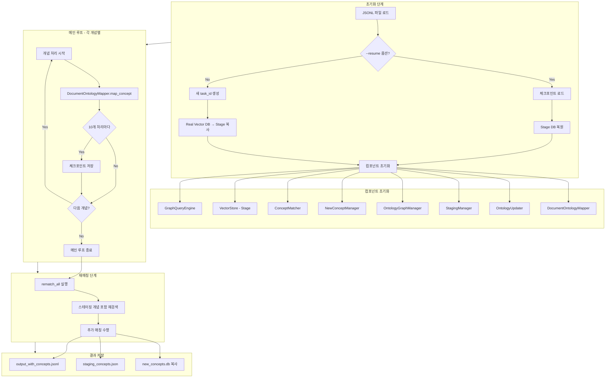
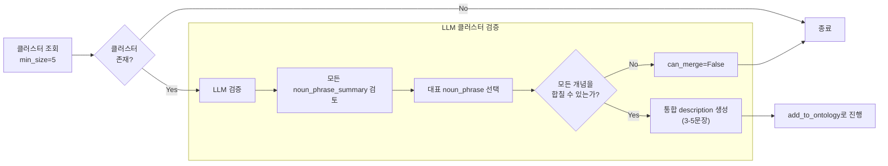
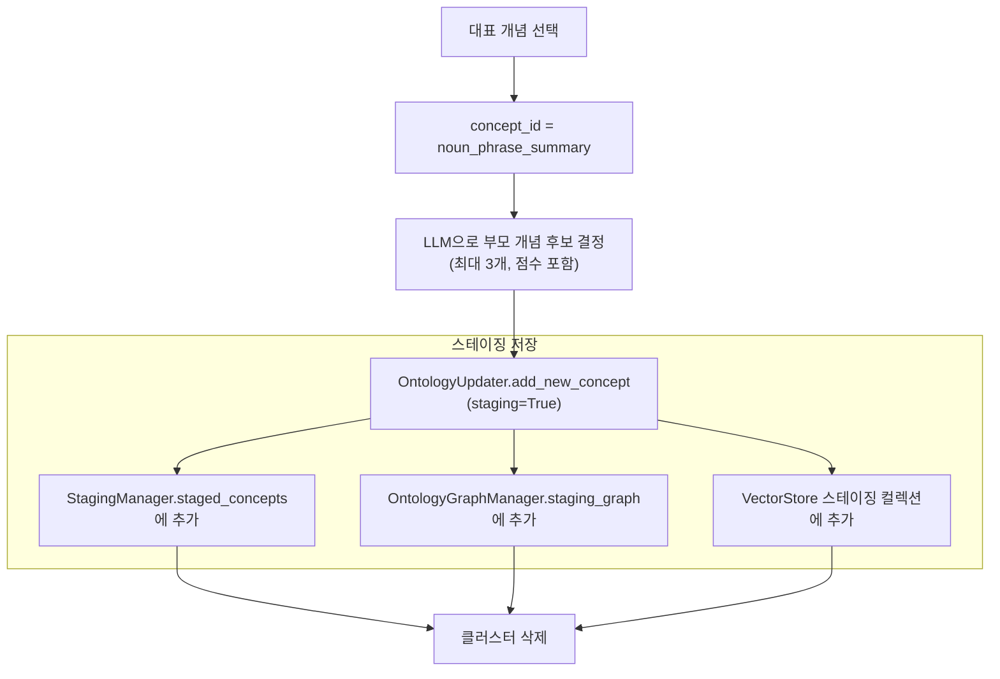
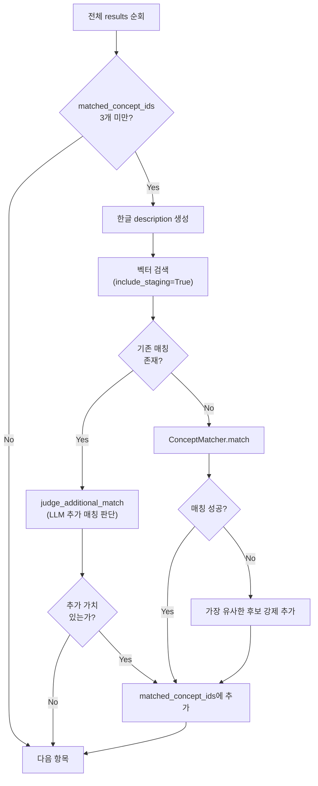
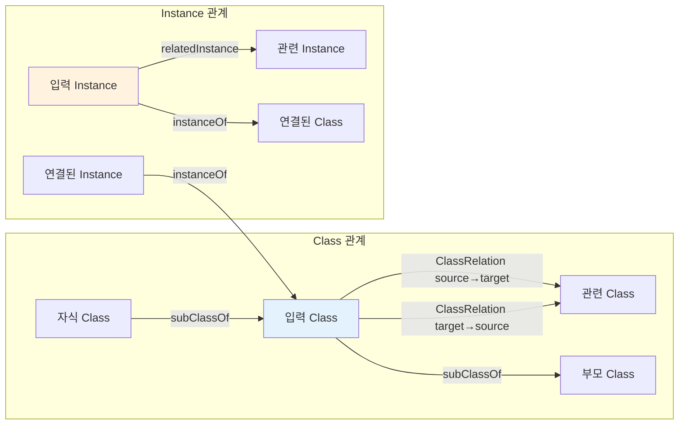
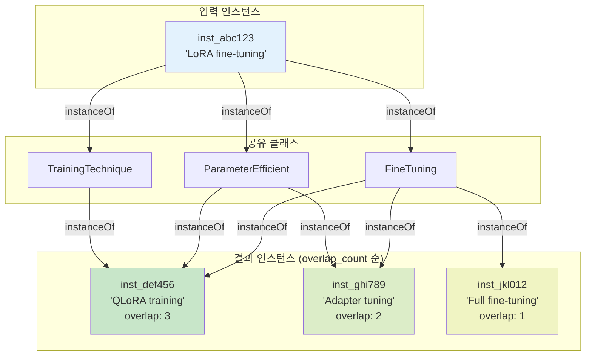

# Ontology Package

온톨로지 관리 패키지. GraphDB를 사용한 그래프 데이터베이스 쿼리 및 문서-온톨로지 매핑 기능을 제공합니다.

## 구조

```
ontology/
├── pyproject.toml
├── README.md
├── setup_graphdb.sh                     # GraphDB Docker 세팅
├── uv.lock
├── data/
│   ├── config.ttl                       # GraphDB Repository 설정
│   ├── llm_ontology.ttl                 # 초기 온톨로지 스키마
│   └── llm_ontology_augmented.ttl       # 확장된 온톨로지
├── db/
│   ├── real/                            # 실제 DB
│   │   ├── new_concepts.db              # 클러스터링용 신규 개념 DB
│   │   └── vector_store/                # ChromaDB (벡터 검색)
│   ├── real.backup/                     # 커밋 전 백업
│   │   └── {timestamp}/
│   │       ├── graphdb_dump.json
│   │       ├── new_concepts.db
│   │       └── vector_store/
│   ├── relations_backup/                # 관계 추가 백업
│   │   └── {timestamp}/
│   │       ├── added_relations.json
│   │       └── metadata.json
│   └── stage/                           # 스테이징 데이터
│       └── {task_name}_{timestamp}/
│           ├── new_concepts.db
│           ├── vector_store/
│           ├── commit_concepts.tsv      # 커밋할 개념 (수동 편집)
│           └── staged_result/
│               ├── output_with_concepts.jsonl
│               ├── staging_concepts.json
│               └── checkpoints/
└── src/
    ├── __init__.py
    ├── utils.py                         # 공통 유틸리티
    ├── storage/                         # 저장소 계층
    │   ├── graph_query_engine.py        # GraphDB SPARQL
    │   ├── vector_store.py              # ChromaDB
    │   └── new_concept_manager.py       # 신규 개념 SQLite
    ├── pipeline/                        # 처리 파이프라인
    │   ├── concept_matcher.py           # 개념 매칭
    │   ├── document_ontology_mapper.py  # LangGraph 워크플로우
    │   ├── ontology_updater.py          # 온톨로지 업데이트
    │   ├── ontology_graph_manager.py    # NetworkX 그래프 관리
    │   ├── staging_manager.py           # 스테이징 관리
    │   └── rematch.py                   # 재매칭
    └── scripts/                         # 실행 스크립트
        ├── assign_ontology_concept_to_chunk.py   # Stage 1
        ├── commit_ontology_assignment.py         # Stage 2
        ├── add_relations.py                      # Stage 3
        ├── rollback_ontology.py                  # 롤백
        └── initialize_vector_db.py               # Vector DB 초기화
```

## 전체 워크플로우

```
                      ┌─────────────────────────────────────────────────┐
                      │              Initial Setup (1회)               │
                      │  setup_graphdb.sh → initialize_vector_db.py    │
                      └─────────────────────────────────────────────────┘
                                              │
                                              ▼
┌──────────────────────────────────────────────────────────────────────────────────────┐
│                                                                                      │
│  ┌────────────────────┐     ┌────────────────────┐     ┌────────────────────┐       │
│  │     Stage 1        │     │     Stage 2        │     │     Stage 3        │       │
│  │  assign_ontology_  │ ──▶ │  commit_ontology_  │ ──▶ │  add_relations.py  │       │
│  │  concept_to_chunk  │     │  assignment.py     │     │                    │       │
│  └────────────────────┘     └────────────────────┘     └────────────────────┘       │
│           │                          │                          │                    │
│           ▼                          ▼                          ▼                    │
│    db/stage/{task}/            GraphDB 커밋              관계(Instance,            │
│    - output_with_concepts.jsonl    + Vector DB               ClassRelation)        │
│    - staging_concepts.json           업데이트                  추가                  │
│                                                                                      │
└──────────────────────────────────────────────────────────────────────────────────────┘
                                              │
                                              ▼
                      ┌─────────────────────────────────────────────────┐
                      │           Rollback (필요시)                     │
                      │         rollback_ontology.py                   │
                      │         add_relations.py --rollback            │
                      └─────────────────────────────────────────────────┘
```

## 초기 설정

### 1. 환경 설정

```bash
cd dev/packages/ontology
uv sync

#  API

export OPENAI_API_KEY="your-REDACTED-api-key"
export OPENAI_MODEL="gpt-4o-mini"

# 또는 OpenAI API
# export OPENAI_API_KEY="your-openai-api-key"
```

### 2. GraphDB 시작

```bash
./setup_graphdb.sh
```

- GraphDB UI: http://localhost:7200
- SPARQL Endpoint: http://localhost:7200/repositories/llm-ontology

```bash
# 컨테이너 관리
docker stop graphdb-ontology   # 중지
docker start graphdb-ontology  # 재시작
docker rm -f graphdb-ontology  # 제거
```

### 3. Vector DB 초기화

```bash
python src/scripts/initialize_vector_db.py
```

TTL 파일에서 모든 개념을 로드하고, description이 없으면 LLM으로 생성한 후 ChromaDB에 저장합니다.

## Stage 1: 개념 매핑 (assign_ontology_concept_to_chunk.py)

JSONL 입력을 처리하여 각 chunk의 개념을 온톨로지에 매핑합니다.

### 입력 형식

```jsonl
{"concept": "LoRA", "section_id": 2, "section_title": "Fine-tuning", "chunk_text": "LoRA는...", "chapter_id": 1}
{"concept": "QLoRA", "section_id": 2, "section_title": "Fine-tuning", "chunk_text": "QLoRA는...", "chapter_id": 1}
```

**필수 필드:**
- `concept`: 개념 이름
- `section_id`: 섹션 ID
- `section_title`: 섹션 제목
- `chunk_text`: 원본 텍스트

**선택 필드:**
- `chapter_id`, `chapter_title`, `book_id`, `book_title` 등

### 실행

```bash
# 새로 시작
python src/scripts/assign_ontology_concept_to_chunk.py \
  --task-name book \
  --input /path/to/concepts.jsonl

# 체크포인트에서 재개
python src/scripts/assign_ontology_concept_to_chunk.py \
  --task-name book \
  --input /path/to/concepts.jsonl \
  --resume

# 디버그 모드
python src/scripts/assign_ontology_concept_to_chunk.py \
  --task-name book \
  --input /path/to/concepts.jsonl \
  --debug
```

### 출력

`db/stage/{task_name}_{timestamp}/` 디렉토리에 저장:
- `staged_result/output_with_concepts.jsonl`: 매핑된 결과
- `staged_result/staging_concepts.json`: 스테이징된 신규 개념
- `staged_result/checkpoints/`: 체크포인트

### 전체 스크립트 흐름



### LangGraph 워크플로우 (DocumentOntologyMapper)

각 개념에 대해 `map_concept()` 호출 시 실행되는 LangGraph StateGraph:

```mermaid
flowchart TD
    Start([시작]) --> ExtractNP[extract_noun_phrases]
    
    subgraph Step1["1. Noun Phrase 추출"]
        ExtractNP --> |"원본 키워드에서<br/>핵심 개념 추출"|NP1["LLM으로 noun phrase 추출<br/>(최대 3개)"]
        NP1 --> NP2["1depth 카테고리 제외<br/>(LLMConcept 자식들)"]
        NP2 --> NP3["concepts 리스트 생성"]
    end
    
    NP3 --> SearchSimilar[search_similar_concepts]
    
    subgraph Step2["2. 벡터 검색"]
        SearchSimilar --> |"각 noun phrase별"|SS1["한글 description 생성<br/>(LLM, 3-5문장)"]
        SS1 --> SS2["ChromaDB 벡터 검색<br/>(include_staging=True)"]
        SS2 --> SS3["상위 5개 후보 추출<br/>(LLMConcept, 1depth 제외)"]
        SS3 --> SS4["concept_candidates에 저장"]
    end
    
    SS4 --> MatchLLM[match_with_llm]
    
    subgraph Step3["3. LLM 매칭"]
        MatchLLM --> |"각 noun phrase별"|ML1["ConceptMatcher.match 호출"]
        ML1 --> ML2{"매칭 성공?"}
        ML2 -->|Yes| ML3["matched_concepts에 추가"]
        ML2 -->|No| ML4["new_concepts에 추가"]
        ML3 --> ML5["matched_concept_ids 설정<br/>(최대 3개)"]
        ML4 --> ML5
    end
    
    ML5 --> CheckNew{new_concepts<br/>존재?}
    CheckNew -->|No| End1([완료])
    CheckNew -->|Yes| SaveNew[save_new_concept]
    
    subgraph Step4["4. 신규 개념 저장"]
        SaveNew --> SN1["각 new_concept별 반복"]
        SN1 --> SN2["한글 description 생성"]
        SN2 --> SN3["NewConceptManager.save_concept<br/>(SQLite 저장)"]
        SN3 --> SN4["noun_phrase_summary,<br/>reason 함께 저장"]
    end
    
    SN4 --> CheckCluster[check_new_concept_clusters]
    
    subgraph Step5["5. 클러스터 검증"]
        CheckCluster --> CC1["get_clusters<br/>(min_size=5)"]
        CC1 --> CC2{클러스터<br/>존재?}
        CC2 -->|No| End2([완료])
        CC2 -->|Yes| CC3["LLM 클러스터 검증"]
        CC3 --> CC4{"can_merge?"}
        CC4 -->|No| End3([완료])
        CC4 -->|Yes| CC5["대표 noun_phrase 선택"]
        CC5 --> CC6["representative_description 생성"]
    end
    
    CC6 --> AddOntology[add_to_ontology]
    
    subgraph Step6["6. 온톨로지 추가 - 스테이징"]
        AddOntology --> AO1["대표 개념 ID 결정<br/>(noun_phrase_summary)"]
        AO1 --> AO2["LLM으로 부모 개념 후보 결정<br/>(최대 3개, 점수 포함)"]
        AO2 --> AO3["OntologyUpdater.add_new_concept<br/>(staging=True)"]
        AO3 --> AO4["StagingManager에 저장"]
        AO4 --> AO5["클러스터 삭제"]
    end
    
    AO5 --> End4([완료])
    
    style Step1 fill:#e3f2fd
    style Step2 fill:#e8f5e9
    style Step3 fill:#fff3e0
    style Step4 fill:#fce4ec
    style Step5 fill:#f3e5f5
    style Step6 fill:#e0f2f1
```



### 노드별 상세 설명

#### 1. extract_noun_phrases (Noun Phrase 추출)

원본 키워드에서 온톨로지에 추가할 핵심 개념만 추출합니다.

```python
# 입력
original_keyword = "Strategic advantages of implementing a Minimum Viable Product"

# 출력 (최대 3개)
concepts = [
    {"concept": "Minimum Viable Product", "context": chunk_text},
    {"concept": "MVP", "context": chunk_text}
]
```

**추출 규칙:**
- 문서 구조 단어 제거 (Overview, Introduction, Guide 등)
- 1depth 카테고리 자체 제외 (LLMConcept 직계 자식들)
- 원본 키워드에 실제로 언급된 개념만 (`mentioned_in_keyword: True`)
- 일반 표현은 기술 개념으로 변환 가능 (예: "content creation" → "TextGeneration")

#### 2. search_similar_concepts (벡터 검색)

각 noun phrase에 대해 한글 설명을 생성하고 유사 개념을 검색합니다.

```python
# 한글 설명 생성 예시
concept = "LoRA"
korean_description = """
LoRA(Low-Rank Adaptation)는 대규모 언어 모델을 효율적으로 파인튜닝하기 위한 기법입니다.
전체 모델 파라미터를 업데이트하는 대신 저랭크 행렬을 사용하여 학습 가능한 파라미터 수를 
대폭 줄입니다. 이를 통해 메모리 사용량을 크게 감소시키면서도 성능 저하를 최소화할 수 있습니다.
"""

# 벡터 검색 결과
candidates = [
    {"concept_id": "FineTuning", "description": "...", "distance": 0.45},
    {"concept_id": "ParameterEfficient", "description": "...", "distance": 0.52},
    ...
]
```

**검색 설정:**
- `include_staging=True`: 이전에 스테이징된 개념도 검색
- `exclude_concept_ids`: LLMConcept과 1depth 자식들 제외
- 상위 5개 후보만 유지

#### 3. match_with_llm (LLM 매칭)

각 noun phrase와 후보 개념을 비교하여 매칭 여부를 결정합니다.

```python
# 매칭 결과 구조
MatchingResult:
    noun_phrase_summary: str    # 3단어 이내 명사구 요약
    most_similar_concept_id: str  # 가장 유사한 후보 ID
    matched_concept_id: str     # 실제 매칭 (합칠 수 있는 경우만)
    reason: str                 # 판단 이유
```

**매칭 판단 기준:**
- **합칠 수 있는 경우**: 동의어, 약어-풀네임, 단순 표현 차이
- **합치면 안 되는 경우**: 새로운 원리/방법론, 중요한 하위 분류, 독립적 추상화 수준

#### 4. save_new_concept (신규 개념 저장)

매칭되지 않은 개념을 SQLite DB에 임시 저장합니다.

```sql
-- new_concepts 테이블
INSERT INTO new_concepts (
    concept,              -- 개념명
    description,          -- 한글 설명
    source,               -- 출처 (section_id 기반)
    original_keyword,     -- 원본 키워드
    noun_phrase_summary,  -- LLM이 추출한 명사구
    reason                -- 매칭 실패 이유
)
```

#### 5. check_new_concept_clusters (클러스터 검증)

5개 이상 모인 클러스터에 대해 LLM 검증을 수행합니다.



**검증 기준:**
- 모든 개념이 동일하거나 매우 유사한 의미인가?
- 차이가 단순 표현 차이인가, 본질적으로 다른 개념인가?
- 각각 독립적으로 학습이 필요한 개념인가?

#### 6. add_to_ontology (온톨로지 추가 - 스테이징)

검증 통과한 클러스터를 스테이징 모드로 온톨로지에 추가합니다.



**저장되는 정보:**
- `concept_id`: 대표 noun_phrase_summary
- `description`: LLM이 생성한 통합 description
- `parent_candidates`: 부모 후보 리스트 (점수 포함)
- `original_keywords`: 클러스터에 포함된 모든 원본 키워드

### 재매칭 단계 (rematch_all)

모든 개념 처리 후, 스테이징된 개념을 포함하여 재매칭을 수행합니다.



**추가 매칭 판단 기준:**
- 후보가 기존 매칭과 중복되지 않는가?
- 후보가 새로운 관점이나 다른 측면을 제공하는가?
- 기존 매칭과 함께 사용될 때 의미가 있는가?

### State 구조 (MappingState)

LangGraph에서 사용하는 상태 딕셔너리:

```python
MappingState = {
    # 입력
    "concept": str,                      # 원본 개념
    "chunk_text": str,                   # 원본 텍스트
    "source": str,                       # 출처 (section_id 기반)
    "metadata": Dict[str, Any],          # section_title 등
    
    # Noun Phrase 추출 결과
    "concepts": List[Dict],              # 추출된 noun phrases
    
    # 벡터 검색 결과
    "candidates": List[Dict],            # 통합 후보 (하위 호환)
    "concept_candidates": Dict[str, List], # 개념별 후보
    "korean_description": str,           # 생성된 한글 설명
    
    # LLM 매칭 결과
    "matched_concepts": List[Dict],      # 매칭 성공한 개념들
    "new_concepts": List[Dict],          # 신규 개념들
    "matched_concept_id": str,           # 첫 번째 매칭 ID
    "matched_concept_ids": List[str],    # 전체 매칭 ID (최대 3개)
    "is_new": bool,                      # 신규 개념 여부
    "reason": str,                       # 매칭/비매칭 이유
    "noun_phrase_summary": str,          # LLM 추출 명사구
    
    # 클러스터 검증 결과
    "should_add_to_ontology": bool,      # 온톨로지 추가 여부
    "cluster": Dict,                     # 검증 통과한 클러스터 정보
}
```

## Stage 2: GraphDB 커밋 (commit_ontology_assignment.py)

스테이징된 개념을 검토 후 GraphDB에 커밋합니다.

### 사전 작업

1. `staging_concepts.json`을 확인하고 커밋할 개념 선별
2. `commit_concepts.tsv` 파일 작성:

```tsv
concept_id	parent_concept
LoRA	FineTuning
QLoRA	FineTuning
```

### 실행

   ```bash
python src/scripts/commit_ontology_assignment.py \
  --tsv db/stage/book_20260105_085420/commit_concepts.tsv \
  --staging-json db/stage/book_20260105_085420/staged_result/staging_concepts.json \
  --stage-db db/stage/book_20260105_085420/new_concepts.db
```

### 처리 내용

1. **백업 생성**: `db/real.backup/{timestamp}/`에 현재 상태 백업
2. **GraphDB 업데이트**: TSV에 지정된 개념 추가
3. **Vector DB 업데이트**: 임베딩 저장
4. **New Concept DB 병합**: 신규 개념 DB 병합 및 재클러스터링

## Stage 3: 관계 추가 (add_relations.py)

매핑된 결과에서 관계를 추출하여 GraphDB에 추가합니다.

### 추가되는 관계 유형

1. **ClassRelation**: 같은 chunk에서 co-occurrence한 클래스 쌍
2. **ConceptInstance**: concept 텍스트를 Instance로 생성
3. **Instance 간 related**: 같은 section_id의 Instance 연결

### 실행

   ```bash
# 관계 추가
python src/scripts/add_relations.py \
  --input db/stage/book_20260105_085420/staged_result/output_with_concepts.jsonl

# Dry-run (미리보기)
python src/scripts/add_relations.py \
  --input db/stage/book_20260105_085420/staged_result/output_with_concepts.jsonl \
  --dry-run
```

### 백업 관리

```bash
# 백업 목록 확인
python src/scripts/add_relations.py --list-backups

# 롤백
python src/scripts/add_relations.py --rollback latest
python src/scripts/add_relations.py --rollback 20260106_142249
```

## 롤백

### 온톨로지 롤백 (commit 되돌리기)

```bash
# 백업 목록 확인
python src/scripts/rollback_ontology.py --list

# 롤백 실행
python src/scripts/rollback_ontology.py --backup 20260106_145604

# 가장 최근 백업으로 롤백
python src/scripts/rollback_ontology.py
```

### 관계 롤백

```bash
python src/scripts/add_relations.py --rollback latest
```

## Python API 사용

### SPARQL 쿼리

```python
from storage import GraphQueryEngine

engine = GraphQueryEngine("http://localhost:7200/repositories/llm-ontology")
result = engine.query("SELECT * WHERE { ?s ?p ?o } LIMIT 10")
```

### Vector 유사도 검색

```python
from storage import VectorStore

vector_store = VectorStore("db/real/vector_store")
results = vector_store.find_similar("attention mechanism", k=5)

for result in results:
    print(f"{result['concept_id']}: {result['description']}")
    print(f"  Distance: {result['distance']}")
```

### 개념 추가

```python
from storage import GraphQueryEngine, VectorStore
from pipeline import OntologyUpdater

graph_engine = GraphQueryEngine("http://localhost:7200/repositories/llm-ontology")
vector_store = VectorStore("db/real/vector_store")
updater = OntologyUpdater(graph_engine=graph_engine, vector_store=vector_store)

updater.add_concept(
    concept_id="LoRA",
    label="LoRA",
    parent="FineTuning",
    description="저랭크 어댑테이션을 통한 효율적인 파인튜닝 기법"
)
```

### 관계 조회 (GraphQueryEngine)

온톨로지에 추가된 관계를 조회하는 두 가지 핵심 함수를 제공합니다.

#### 테스트 스크립트 실행

```bash
python src/scripts/test_query_engine.py
```

**사전 요구사항:**
- GraphDB가 실행 중이어야 함 (`docker start graphdb-ontology`)
- `add_relations.py`로 관계가 추가되어 있어야 함 (Instance 관련 조회용)

---

#### 1. get_related_nodes - 관련 노드 조회

특정 개념(Class) 또는 인스턴스(Instance)와 관련된 모든 노드를 가져옵니다.

```python
from storage.graph_query_engine import GraphQueryEngine, NodeFilter

engine = GraphQueryEngine("http://localhost:7200/repositories/llm-ontology")

# 기본 사용 (모든 관련 노드)
results = engine.get_related_nodes("RAG", NodeFilter.ALL, top_k=10)

# Class만 필터링
results = engine.get_related_nodes("RAG", NodeFilter.ONLY_CLASS, top_k=10)

# Instance만 필터링
results = engine.get_related_nodes("RAG", NodeFilter.ONLY_INSTANCE, top_k=10)
```

**파라미터:**

| 파라미터 | 타입 | 설명 |
|----------|------|------|
| `label_or_id` | str | 검색할 노드의 label 또는 concept ID |
| `filter_type` | NodeFilter | `ALL`, `ONLY_CLASS`, `ONLY_INSTANCE` |
| `top_k` | int | 반환할 최대 노드 수 (기본값: 10) |

**반환 구조:**

```python
[
    {
        "id": "Finetuning",           # 관련 노드 ID
        "label": "Fine-tuning",        # 레이블
        "description": "모델을 특정 태스크에...",  # 설명
        "weight": 15,                  # co-occurrence 가중치
        "node_type": "class"           # 'class' 또는 'instance'
    },
    ...
]
```

**탐색하는 관계 유형:**



| 관계 타입 | 방향 | 설명 |
|-----------|------|------|
| `ClassRelation` | 양방향 | `add_relations.py`로 추가된 클래스 간 co-occurrence |
| `subClassOf` | 입력→부모 | 온톨로지 계층 구조 (부모) |
| `hasSubClass` | 자식→입력 | 온톨로지 계층 구조 (자식) |
| `relatedInstance` | 양방향 | 같은 section의 Instance 간 관계 |
| `instanceOf` | Instance→Class | Instance가 속한 Class |
| `hasInstance` | Class→Instance | Class에 속한 Instance |

**사용 예시:**

```python
# RAG 개념과 관련된 상위 5개 노드 조회
results = engine.get_related_nodes("RAG", NodeFilter.ALL, top_k=5)

for node in results:
    print(f"[{node['node_type']}] {node['id']}")
    print(f"  label: {node['label']}")
    print(f"  weight: {node['weight']}")
    if node['description']:
        print(f"  description: {node['description'][:100]}...")
    print()
```

**출력 예시:**

```
[class] VectorStore
  label: Vector Store
  weight: 23
  description: 벡터 임베딩을 저장하고 검색하는 데이터베이스...

[class] Embedding
  label: Embedding
  weight: 18
  description: 텍스트나 데이터를 고정 길이 벡터로 변환...

[class] KnowledgeIntegration
  label: Knowledge Integration
  weight: 0
  description: 외부 지식을 LLM에 통합하는 방법론...
```

---

#### 2. get_overlap_concept_instances - 중복 클래스 인스턴스 조회

특정 인스턴스와 같은 클래스(Class)를 공유하는 다른 인스턴스들을 찾습니다. 
중복 클래스 수가 많은 순으로 정렬됩니다.

```python
from storage.graph_query_engine import GraphQueryEngine

engine = GraphQueryEngine("http://localhost:7200/repositories/llm-ontology")

# 인스턴스 ID로 조회
results = engine.get_overlap_concept_instances("inst_abc123", top_k=10)

# 인스턴스 label로 조회
results = engine.get_overlap_concept_instances("LoRA fine-tuning", top_k=10)
```

**파라미터:**

| 파라미터 | 타입 | 설명 |
|----------|------|------|
| `label_or_id` | str | 검색할 인스턴스의 label 또는 ID |
| `top_k` | int | 반환할 최대 인스턴스 수 (기본값: 10) |

**반환 구조:**

```python
[
    {
        "id": "inst_def456",           # 인스턴스 ID
        "label": "QLoRA training",      # 레이블
        "description": "",              # 설명 (있는 경우)
        "overlap_count": 3              # 공유하는 클래스 수
    },
    ...
]
```

**동작 원리:**



**사용 예시:**

```python
# 특정 인스턴스와 가장 관련성 높은 인스턴스 찾기
results = engine.get_overlap_concept_instances("inst_abc123", top_k=5)

for inst in results:
    print(f"[{inst['overlap_count']}개 클래스 공유] {inst['id']}")
    print(f"  label: {inst['label']}")
    print()
```

**출력 예시:**

```
[3개 클래스 공유] inst_def456
  label: QLoRA training for LLM optimization

[2개 클래스 공유] inst_ghi789
  label: Adapter-based fine-tuning approach

[1개 클래스 공유] inst_jkl012
  label: Full model fine-tuning strategy
```

**활용 사례:**
- 유사한 주제를 다루는 문서 청크 찾기
- 같은 개념 영역에 속하는 키워드 그룹 발견
- 온톨로지 구조 분석 및 시각화

---

#### NodeFilter 옵션

`get_related_nodes`에서 사용하는 필터 타입:

```python
from storage.graph_query_engine import NodeFilter

# 모든 관련 노드 (Class + Instance)
NodeFilter.ALL

# Class만 반환
NodeFilter.ONLY_CLASS

# Instance만 반환
NodeFilter.ONLY_INSTANCE
```

## 데이터 관리 전략

### 1. Graph DB (단일 진실 소스)
- 모든 개념과 관계는 GraphDB에 저장
- `data/llm_ontology.ttl`은 초기 스키마만 (동적 업데이트 안 함)

### 2. ChromaDB (검색 최적화)
- BAAI/bge-m3 모델 사용 (8192 토큰, 100+ 언어)
- GraphDB와 동기화

### 3. 스테이징 시스템
- 신규 개념은 `db/stage/`에 임시 저장
- 검토 후 `commit_ontology_assignment.py`로 반영

### 4. 백업 전략
- 커밋 전: `db/real.backup/{timestamp}/`
- 관계 추가 전: `db/relations_backup/{timestamp}/`

## 의존성

- `chromadb>=0.4` - 벡터 DB
- `sentence-transformers>=5.2.0` - 임베딩 모델 (BAAI/bge-m3)
- `langchain>=0.3` + `langgraph` - LangGraph 워크플로우
- `langchain-openai>=1.1.6` - OpenAI 통합
- `rdflib`, `SPARQLWrapper` - RDF/SPARQL 처리
- `networkx>=3.0` - 그래프 구조 관리
- `tqdm>=4.0` - 진행률 표시

## 설치

```bash
cd dev/packages/ontology
uv sync
```
