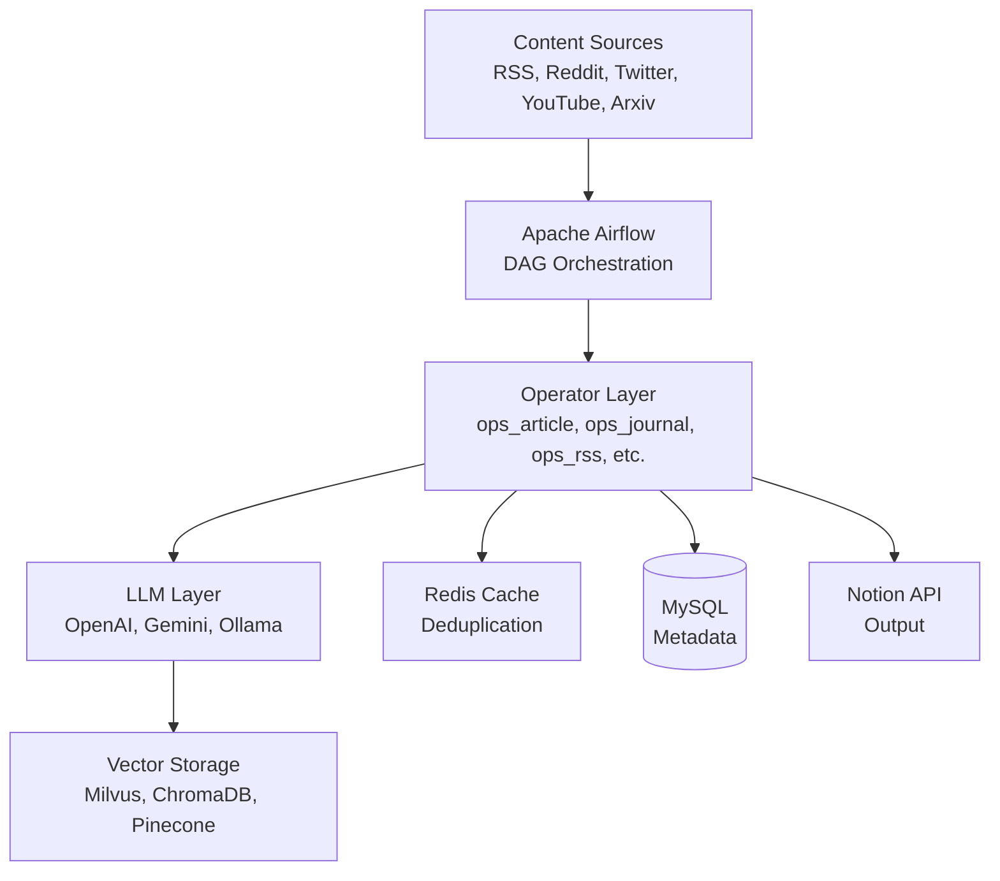
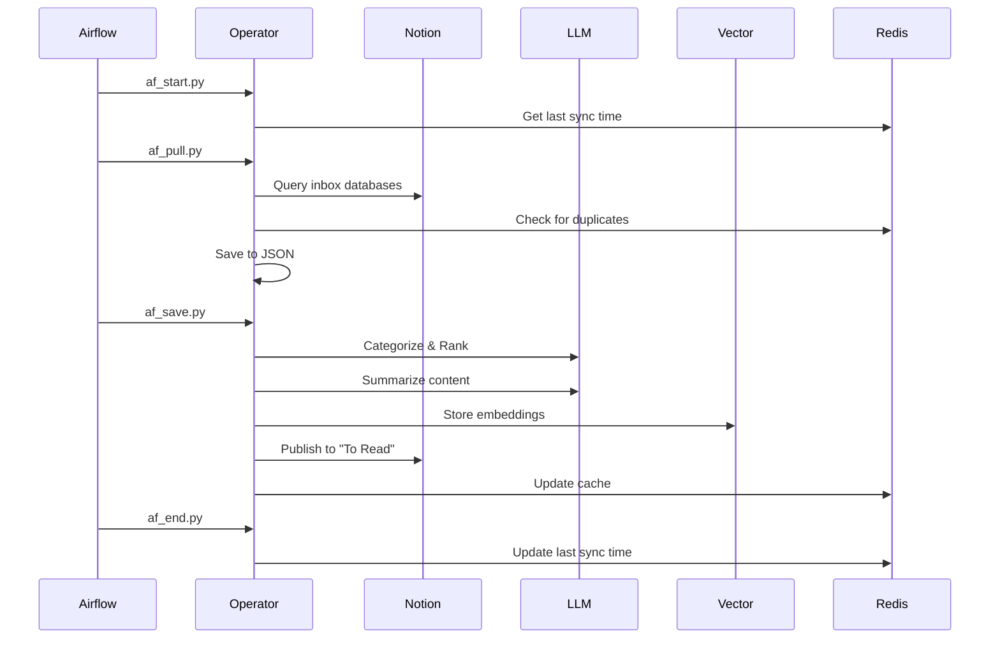

# Architecture Documentation: API (Auto-News)

## Executive Summary

The Auto-News API is an **event-driven data pipeline** built on Apache Airflow that automates content aggregation, LLM-powered processing, and intelligent distribution. The architecture follows a modular operator pattern with pluggable LLM backends and vector storage options.

**Architecture Style**: Event-Driven Pipeline with DAG Orchestration
**Primary Pattern**: Operator Pattern with Dependency Injection
**Deployment**: Containerized microservices (Docker/Kubernetes)

## System Architecture

### High-Level Architecture



### Technology Stack

| Layer | Technology | Version | Purpose |
|-------|------------|---------|---------|
| **Orchestration** | Apache Airflow | 2.8.4 | DAG scheduling and task execution |
| **Runtime** | Python | 3.11 | Primary programming language |
| **LLM Framework** | LangChain | 0.3.1 | LLM integration and chains |
| **RAG Framework** | LlamaIndex | 0.9+ | Retrieval-augmented generation |
| **Multi-Agent** | AutoGen (ag2) | 0.2.2 | Multi-agent collaboration |
| **Relational DB** | MySQL | 8.x | Metadata and index storage |
| **Cache** | Redis | Latest | Deduplication and temporary storage |
| **Vector DB** | Milvus | 2.4+ | Primary vector storage |
| **Vector DB** | ChromaDB | 0.4+ | Alternative vector storage |
| **Vector DB** | Pinecone | Latest | Cloud vector storage option |
| **Container** | Docker | Latest | Application containerization |
| **Orchestrator** | Kubernetes | Latest | Container orchestration |
| **Package Manager** | Helm | Latest | K8s deployment management |
| **GitOps** | ArgoCD | Latest | Continuous deployment |

## Architecture Patterns

### 1. Operator Pattern

Each content type has a dedicated operator class that encapsulates all logic for that type:

```python
class OperatorArticle(OperatorBase):
    def pull(self):        # Fetch from source
    def dedup(self):       # Deduplicate
    def summarize(self):   # LLM summarization
    def ranking(self):     # LLM ranking
    def publish(self):     # Publish to Notion
```

**Benefits**:
- Clear separation of concerns
- Easy to add new content types
- Testable in isolation
- Reusable across DAGs

### 2. Multi-LLM Backend

Pluggable LLM provider system:

```
LLMAgent (Interface)
├── ChatOpenAI
├── ChatGoogleGenerativeAI (Gemini)
└── ChatOllama (Local)
```

**Configuration**: Environment variables select provider
**Fallback**: Can switch providers without code changes

### 3. Layered Architecture

```
┌─────────────────────────────────┐
│   Airflow DAG Layer             │  # Scheduling & orchestration
├─────────────────────────────────┤
│   Task Operator Layer (af_*.py) │  # Airflow task wrappers
├─────────────────────────────────┤
│   Business Logic (ops_*.py)     │  # Core operators
├─────────────────────────────────┤
│   LLM Layer (llm_*.py)           │  # LLM integration
├─────────────────────────────────┤
│   Embedding Layer (embedding_*) │  # Vector embeddings
├─────────────────────────────────┤
│   Data Layer (*_cli.py, db_*.py)│  # Database clients
└─────────────────────────────────┘
```

## Data Flow

### News Pulling Pipeline (news_pulling DAG)



### Content Processing Flow

1. **Ingestion**:
   - Operators pull from configured sources
   - Raw content saved to local JSON

2. **Deduplication**:
   - Redis cache checks for existing content
   - Based on page_id or content hash

3. **LLM Processing**:
   - **Categorization**: Classify content by topic/category
   - **Ranking**: Score relevance based on user interests (0-100)
   - **Summarization**: Generate key insights and takeaways
   - **TODO Extraction**: Identify actionable items

4. **Embedding**:
   - Content vectorized using selected provider
   - Stored in vector database for semantic search

5. **Distribution**:
   - High-ranked content published to Notion
   - Organized by category and priority

## Component Architecture

### DAG Layer

Six Airflow DAGs orchestrate the pipeline:

```
news_pulling.py       # Hourly: Main content aggregation
collect_weekly.py     # Weekly: Top content recap
journal_daily.py      # Daily: Journal processing
sync_dist.py          # On-demand: Distribution sync
todo.py               # Daily: TODO extraction
upgrade.py            # Manual: System upgrades
```

**Scheduling**: Cron-based (e.g., `"15 * * * *"` for hourly at :15)
**Concurrency**: `max_active_runs=1` to prevent overlaps

### Operator Layer

**Article Operators**:
- `OperatorArticle`: Web articles and RSS
- `OperatorJournal`: Journal notes
- `OperatorYouTube`: Video transcripts
- `OperatorTwitter`: Tweets
- `OperatorReddit`: Reddit posts
- `OperatorRSS`: RSS feeds

**Supporting Operators**:
- `OperatorNotion`: Notion API integration
- `OperatorObsidian`: Obsidian vault integration
- `OperatorCollection`: Weekly collection
- `OperatorStats`: Analytics
- `OperatorDeepDive`: Multi-agent research

### LLM Integration Layer

**LLMAgent Components**:
- `LLMAgentCategoryAndRanking`: Content classification
- `LLMAgentSummary`: Summarization
- `LLMWebLoader`: Web page loading
- `LLMYoutubeLoader`: YouTube transcript extraction
- `LLMArxivLoader`: Arxiv paper loading

**Prompt Management**:
- Centralized in `llm_prompts.py`
- Template-based with variable substitution
- LangChain PromptTemplate integration

### Embedding Layer

**Multiple Provider Support**:
- `embedding_openai.py`: OpenAI embeddings (v0.x, v1.x)
- `embedding_hf.py`: HuggingFace models
- `embedding_ollama.py`: Local Ollama models

**Caching**:
- Redis cache for embeddings (TTL: 4 weeks)
- Reduces API costs and latency

### Data Layer

**MySQL Schema**:
```sql
patch              # Migration tracking
index_pages        # Notion index pages
```

**Redis Keys**:
- `notion_inbox_created_time_*`: Last sync timestamps
- `notion_inbox_item_id_*`: Inbox dedup
- `notion_toread_item_id_*`: To-read dedup
- `notion_ranking_item_id_*`: Cached rankings (TTL: 2 weeks)
- `notion_summary_item_id_*`: Cached summaries (TTL: 2 weeks)
- `embedding_item_id_*`: Cached embeddings (TTL: 4 weeks)
- `milvus_embedding_item_id_*`: Milvus-specific embeddings

**Vector Storage**:
- Collections per content type and source
- Metadata includes: title, URL, category, timestamp
- Semantic search for similar content

## Integration Points

### External APIs

| Service | Purpose | Authentication |
|---------|---------|----------------|
| **Notion** | Primary output interface | API token |
| **OpenAI** | LLM and embeddings | API key |
| **Google Gemini** | Alternative LLM | API key |
| **Twitter** | Tweet ingestion | OAuth |
| **Reddit** | Reddit post ingestion | OAuth |
| **YouTube** | Transcript extraction | API key |

### Database Connections

- **MySQL**: Connection via `mysql-connector-python`
- **Redis**: Connection via `redis.from_url()`
- **Milvus**: gRPC connection
- **ChromaDB**: HTTP client

## Deployment Architecture

### Docker Compose (Local/Small Scale)

```
Services:
- auto-news-airflow-webserver
- auto-news-airflow-scheduler
- auto-news-airflow-worker
- postgres (Airflow metadata)
- redis
- mysql
- milvus
```

**Network**: Custom bridge network `bot_network`
**Volumes**: Persistent storage for data and logs

### Kubernetes (Production)

```
Namespaces: auto-news

Deployments:
- airflow-webserver
- airflow-scheduler
- airflow-worker (CeleryExecutor)

StatefulSets:
- postgres
- redis
- mysql
- milvus

Services:
- airflow-webserver (LoadBalancer)
- postgres (ClusterIP)
- redis (ClusterIP)
- mysql (ClusterIP)
- milvus (ClusterIP)

ConfigMaps: Environment variables
Secrets: API keys, passwords
```

**Helm Chart**: `dev/apps/api/helm/`
**ArgoCD**: GitOps deployment from `dev/apps/api/argocd/`

## Security Architecture

### Secrets Management

- Environment variables for API keys
- Kubernetes secrets for sensitive data
- No hardcoded credentials

### Network Security

- Internal services on ClusterIP (not exposed)
- External access via LoadBalancer/Ingress
- Redis and MySQL not publicly accessible

### Data Privacy

- User interest profiles stored locally
- LLM providers process content (check ToS)
- Notion data controlled by user

## Performance Considerations

### Caching Strategy

1. **Redis L1 Cache**: Fast lookups for duplicates
2. **Embedding Cache**: Reduce API calls (4-week TTL)
3. **LLM Response Cache**: Ranking/summary cache (2-week TTL)

### Batch Processing

- DAGs process items in batches
- Parallel execution where possible
- Rate limiting for external APIs

### Vector Search Optimization

- Milvus indexes for fast similarity search
- Collection segmentation by content type
- Periodic index optimization

## Scalability

### Horizontal Scaling

- Airflow workers can scale via CeleryExecutor
- Kubernetes horizontal pod autoscaling
- Milvus supports distributed deployment

### Vertical Scaling

- Increase worker memory for large LLM contexts
- GPU support for local embedding models (Ollama)

## Error Handling

### Retry Logic

- Airflow task retries (configurable per DAG)
- Exponential backoff for API calls
- Circuit breaker pattern for external services

### Failure Recovery

- Task state persisted in Airflow DB
- Failed tasks can be retried manually
- Logs stored for debugging

## Monitoring and Observability

### Airflow UI

- DAG run history
- Task logs
- Performance metrics

### Application Logs

- Structured logging to stdout
- Log aggregation via Kubernetes

## Future Architecture Considerations

### Planned Improvements

1. **Web Frontend** (dev/apps/web/):
   - Next.js application
   - Real-time updates via WebSocket
   - User preference management UI

2. **Agent System** (dev/apps/agent/):
   - Prompt management interface
   - A/B testing for prompts
   - Performance metrics dashboard

3. **API Layer**:
   - REST API for programmatic access
   - GraphQL for flexible queries

## Technology Decision Rationale

| Decision | Rationale |
|----------|-----------|
| **Apache Airflow** | Mature orchestration, rich UI, Python-native |
| **LangChain** | Unified LLM interface, chain composition |
| **Milvus** | High-performance vector search, production-ready |
| **Redis** | Fast in-memory cache, simple key-value operations |
| **MySQL** | Relational data, ACID guarantees |
| **Docker/K8s** | Portable, scalable, industry standard |
| **Notion as UI** | Rapid development, user-familiar interface |

## Development Workflow

### Local Development

1. Run `make deps` - Set up environment
2. Run `make build` - Build Docker image
3. Run `make deploy` - Deploy services
4. Run `make init` - Initialize databases
5. Run `make start` - Start Airflow
6. Access Airflow UI at `http://localhost:8080`

### CI/CD

- GitHub Actions for testing
- ArgoCD for continuous deployment
- Helm for release management

## Testing Strategy

### Unit Tests

- Operator logic tested in isolation
- Mocked external dependencies

### Integration Tests

- End-to-end DAG execution
- Real database connections (test env)

### Manual Testing

- Airflow UI for DAG testing
- Notion workspace for output verification

## Documentation

- Comprehensive README in `dev/apps/api/`
- Wiki: https://github.com/finaldie/auto-news/wiki
- Code comments for complex logic
- This architecture document

## Contact and Support

- GitHub Issues: https://github.com/finaldie/auto-news/issues
- Original Author: Yuzhang Hu (hyzwowtools@gmail.com)
